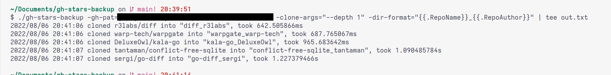

# gh-stars-backup

## Why?

I needed a way to backup all my starred repositories from github.

## What?

This binary clones (pulls if they're already cloned) all your starred repos from github.

## How?

The binary lists all your starred repositories and calls `git clone` for each of them.  
If they already exist, it calls `git pull` instead.

## Requirements

- you must have `git` installed.
- you will need a Github PAT (personal access token) with scope `repo` and `user`.
  - [creating a github PAT](https://docs.github.com/en/authentication/keeping-your-account-and-data-secure/creating-a-personal-access-token)

# Usage

```sh
$ ./gh-stars-backup --help
Usage of gh-stars-backup:
  -clone-args string
        arguments for git clone
  -dir-format string
        go template that specifies the format of git directories (default "{{.RepoName}} [{{.RepoAuthor}}]")
  -gh-pat string
        github pat token, scope: repo & user
  -limit int
        goroutine limiter for cloning/pulling repos (default 16)
  -output-dir string
        the directory where the repos will be saved (default "./")
  -pull-args string
        arguments for git pull
```

It also takes the flags as environment variables if available, transform the flags to uppercase (ex: `CLONE_ARGS`)
example usage:

## As a binary

You can install the binary for your OS from the [github releases tab](https://github.com/DeluxeOwl/gh-stars-backup/releases).


```sh
./gh-stars-backup -gh-pat=<your_pat_token> -clone-args="--depth 1" -dir-format="{{.RepoName}}_{{.RepoAuthor}}" -output-dir="./ghbackup" | tee out.txt
# or with an env variable only
GH_PAT=<my_pat_token> ./gh-stars-backup
```



## As a docker image

**note:** only for x86

```sh
docker build -t gh-stars-backup .

docker run -v `pwd`/test:/ghstars gh-stars-backup -gh-pat=<your_pat_token> -output-dir="./ghstars"
# or if you dont want to build it
docker run -v `pwd`/test:/ghstars nospamplease/gh-stars-backup -gh-pat=<your_pat_token> -output-dir="./ghstars"
```

## As a cronjob

```sh
5 13 * * * /path/to/gh-stars-backup -gh-pat=<your_pat_token> -output-dir=<directory_where_you_want_to_save>
```

## As a cronjob in kubernetes

```yaml
apiVersion: batch/v1
kind: CronJob
metadata:
  name: gh-stars-backup
spec:
  schedule: "5 13 * * *"
  jobTemplate:
    spec:
      template:
        spec:
          containers:
            - name: gh-stars-backup
              image: nospamplease/gh-stars-backup
              imagePullPolicy: IfNotPresent
              command:
                - /bin/sh
                - -c
                - /gh-stars-backup
              env:
                - name: GH_PAT
                  value: <your_pat_token>
          restartPolicy: OnFailure
```
